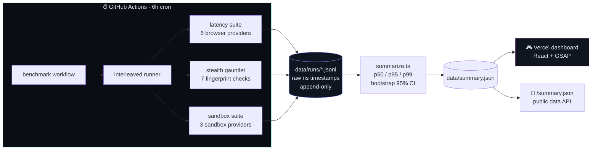
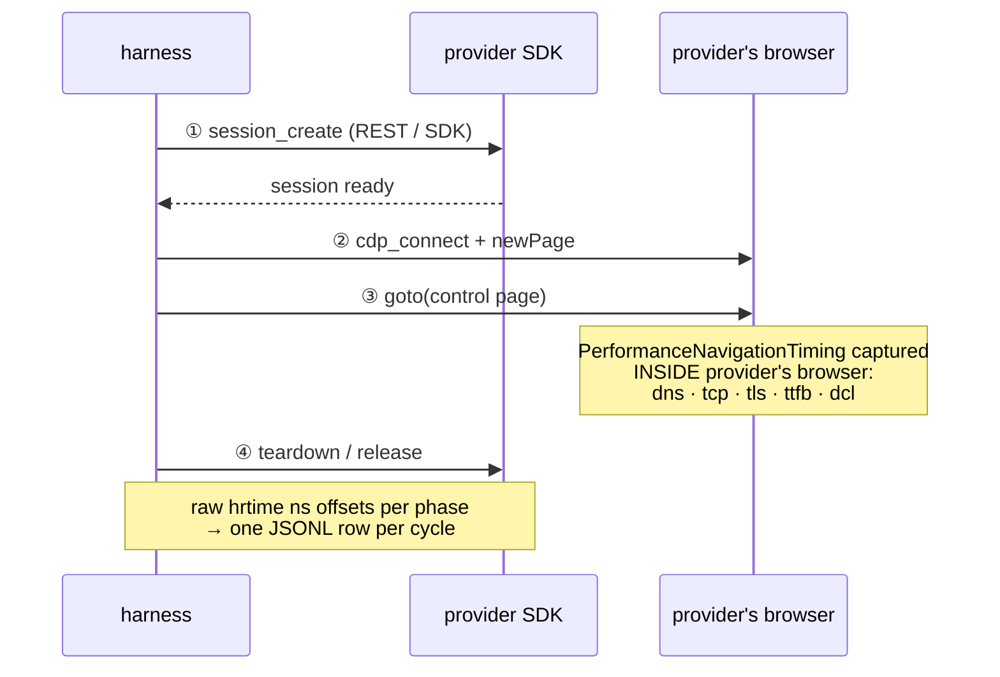
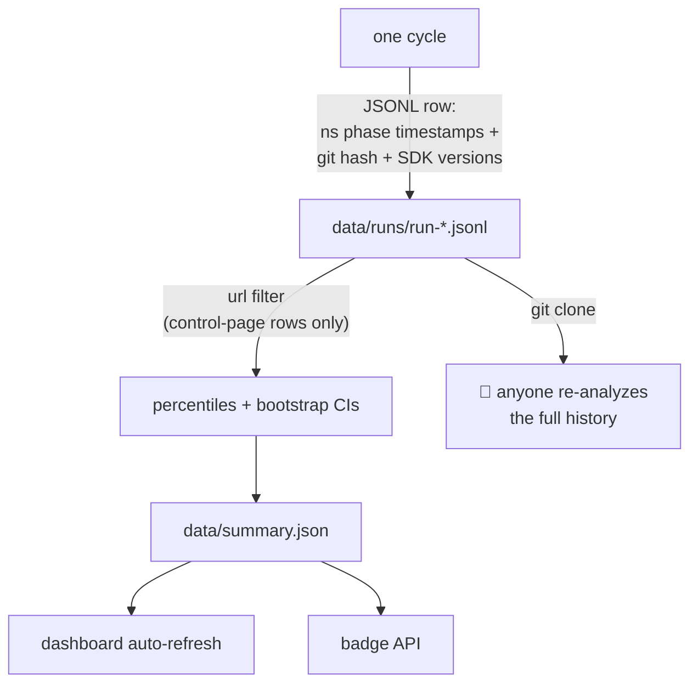

<div align="center">

# ⏱ agentbench

[](https://agentbench-live.vercel.app)
[](https://agentbench-live.vercel.app/summary.json)
[](https://github.com/Shafwansafi06/agentbench/actions/workflows/benchmark.yml)
[](https://github.com/Shafwansafi06/agentbench/commits/main/)

[](https://www.typescriptlang.org/)
[](.github/workflows/benchmark.yml)
[](LICENSE)
[](CONTRIBUTING.md)
[](#providers)
[](#providers)

</div>

> The first continuously-running, reproducible benchmark for cloud browser and
> sandbox providers serving **AI agents**.

**Vendor benchmarks are marketing.** Self-run, happy-path, stale the day they're
posted. This one runs on a schedule, in public, with the code and raw data open —
so anyone can clone the repo and recompute every number.

| | |
|---|---|
| 🔴 **Live dashboard** | https://agentbench-live.vercel.app |
| 🔌 **Data API** | https://agentbench-live.vercel.app/summary.json |
| 📦 **Raw data** | `data/runs/` — append-only JSONL, committed by CI every 6h |
| 📐 **Methodology** | pre-registered 2026-09-02 → [METHODOLOGY.md](METHODOLOGY.md) |
| 🤝 **Add a provider** | < 30 min → [CONTRIBUTING.md](CONTRIBUTING.md) |

---

## How it works



**The measurement cycle** — every provider runs the exact same lifecycle, in
interleaved (round-robin) order:



Key isolation trick: the control page is a version-pinned ~80 KiB page we
self-host on [Vercel](https://control-page-live.vercel.app) — never
`example.com` — and network timings are read from **inside the provider's own
browser**, so CDN noise and harness network are separated from provider
overhead.

## Providers

| Primitive | Providers | Status |
|---|---|---|
| 🌐 Browser | Solari · Browserbase · Steel · Kernel · Hyperbrowser · Anchor | 6 adapters |
| 📦 Sandbox | Solari · E2B · Daytona | 3 adapters |
| 🖥 Desktop | — | roadmap (Modal listed *not measured* — no Node SDK) |

Every adapter implements one tiny interface and is one line in the registry.
A missing provider is never silently skipped — it's listed in results as
**"not measured — no access."**

## Quickstart

```bash
git clone https://github.com/Shafwansafi06/agentbench
cd agentbench
npm install
cp .env.example .env        # add the API keys you have
npm run providers           # which providers are configured?
npm run bench -- --providers solari,kernel --n 20
```

```bash
# other primitives:
npm run bench -- --primitive sandbox --providers solari,e2b,daytona --n 10
npm run bench -- stealth --providers solari,kernel --n 10   # fingerprint gauntlet
npm run bench -- --providers solari --sustained 100         # p95-degradation loop
```

Output: a latency table (p50/p95/p99 with bootstrap 95% CIs), per-phase
breakdown, and an append-only JSONL of every cycle in `data/runs/` — raw
nanosecond phase timestamps, committed to the repo.

## Design principles

- **Interleaved execution.** Providers are round-robined within every cycle.
  Sequential execution lets network conditions and time-of-day bias results —
  the mistake most vendor benchmarks make.
- **Raw data or it didn't happen.** Every phase boundary is stored as a raw
  timestamp. Metrics are recomputed, never pre-aggregated.
- **Publish whatever the numbers say.** Failures, outliers, and providers
  that beat the favorites get the same treatment. No cherry-picking.
- **Honest about fused phases.** Where an SDK fuses create+connect
  (Solari's `launch()`), the data marks it `fused` instead of letting the
  span masquerade as a split measurement.
- **Extensible.** A provider is one small interface
  (`BrowserProviderAdapter`) plus one line in the registry.

## Why trust these numbers

See [METHODOLOGY.md](METHODOLOGY.md) for the full pre-registered protocol.

- **Interleaved** — providers round-robined within every cycle
- **Raw data committed** — ns timestamps, harness git hash, SDK versions per row
- **Failures published** — error strings in the data, nothing filtered
- **Pre-registered** — methodology dated 2026-09-02, changes only as new dated entries
- **Deterministic stats** — fixed-seed bootstrap, anyone can recompute from JSONL

## Data pipeline



## Contributing

Add a provider in under 30 minutes — implement
`BrowserProviderAdapter`/`SandboxProviderAdapter`, one line in the registry,
disclose your SDK version and plan tier. Full rules:
[CONTRIBUTING.md](CONTRIBUTING.md).

## Roadmap

- [x] 6 browser providers: Solari, Browserbase, Steel, Kernel, Hyperbrowser, Anchor
- [x] 3 sandbox providers: Solari, E2B, Daytona (Modal: no Node SDK — listed as not measured)
- [x] Self-hosted control page (Vercel) + in-page PerformanceNavigationTiming isolation
- [x] Stealth gauntlet: 7 self-contained fingerprint checks
- [x] Sustained agent loop with p95 degradation report
- [x] Dashboard (React + GSAP) + JSON API + scheduled CI runs
- [x] Contributor guide ([CONTRIBUTING.md](CONTRIBUTING.md))
- [x] Verified pricing for 7/9 providers ([data/pricing.json](data/pricing.json))
- [ ] Cost per 1k sessions on the dashboard
- [ ] 3-region matrix (needs paid GH runners — standard runners disclose no region)
- [ ] Third-party gauntlet sites (CreepJS, sannysoft) — flaky, so self-contained checks shipped first
- [ ] npm publish

## License

MIT licensed. Numbers belong to everyone — clone, recompute, cite.

<div align="center">
  <sub>built as a <a href="https://www.linkedin.com/company/getsolari/">Solari</a> build challenge entry — Pinetree Research SWE intern application</sub>
</div>
